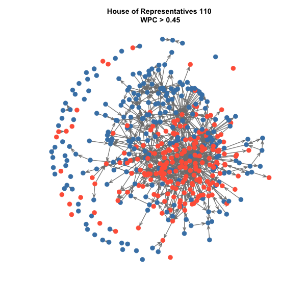
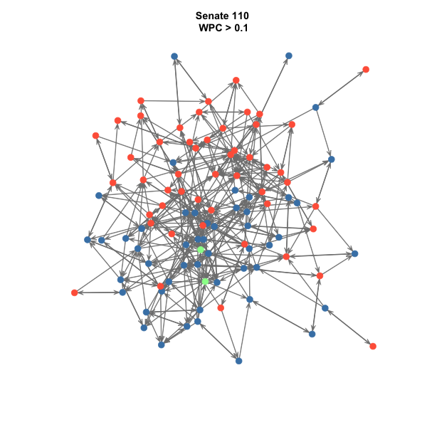

This repository creates U.S. Congress bill cosponsorship network data similar to that of [Fowler, Waugh and Sohn][fws], ranging from 1973 to today in both chambers. The code mimicks the code used for the [parlnet](https://github.com/briatte/parlnet) project, which builds legislative cosponsorship networks for European countries.

# HOWTO

Replicate by running `make.r` in R after checking the dependencies at the top of the script.

The `data.r` script downloads information on bills and sponsors:

- The bills data come from the [Library of Congress](https://www.congress.gov) via [The Sunlight Foundation](http://sunlightfoundation.com/)'s JSON dumps of the data (which, incidentally, also includes amendments and votes). See [this documentation page](https://github.com/unitedstates/congress/wiki/bills) for the details, and [this page](https://github.com/unitedstates/congress/wiki) for links to the dumps. It is possible to get just the bills data [from GovTrack.us](https://www.govtrack.us/developers/data), but it would introduce a dependency to `rsync` (and of course, it is possible to scrape THOMAS.gov directly, but that would duplicate excellent existing work). The code gets the full data dumps but only parses the bills. It does so very slowly because all data are read from the ZIP archives directly. 
- The sponsors data come (in YAML format, which is nice) from [this repository](https://github.com/unitedstates/congress-legislators), which does a wonderful job at matching the various identifiers that might apply to Congressmen, and also provides tons of additional things like social media accounts. The code will extract the sponsors' THOMAS identifiers, ICPSR identifiers, full names, date of birth, gender and constituency (i.e. state, without the district number for Representatives). The data include one row per sponsor term, which makes it easy to compute seniority on the fly while building the cosponsorship networks.

The `data.r` script exports cosponsorships as CSV edge lists instead of adjacency matrices. The edge lists feature one bill per row and the following variables:

- `file`: the filename from which the information come from (which includes the chamber of introduction, the Congressional session of introduction, the type of the bill, and the bill number); 
- `date` and `status`: the date of introduction and outcome status of the bill (there is a nice guide to bill status codes at the end of [this page](https://github.com/unitedstates/congress/wiki/bills#bill-status-codes)); the JSON data also include tons of additional information
- `sponsor`: the THOMAS identifier of the bill sponsor (bills without a THOMAS identifier for their sponsors, i.e. a very small number of committee bills, are ignored during parsing and are not included in the edge lists);
- `cosponsors` and `withdrawn`: the THOMAS identifiers of the bill cosponsors, separated by semicolons; the `withdrawn` column contains the identifiers for withdrawn sponsors, who might have cosponsored the bill again and might therefore also appear in the `cosponsors` list

The `build.r` script builds networks similar to those built by Gross, Kirkland and Shalizi's “Cosponsorship in the U.S. Senate” paper, using the same weighting scheme (the weighted propensity to cosponsor) for edges. Here are two example graphs showing the 110th Congress at two different edge weight thresholds:

Node colors show party affiliations (Democrats in light blue, Republicans in light red, independents in light green), and placement is Fruchterman-Reingold force-directed. It should be very easy to play with the `network` objects produced by `build.r` to produce different plots, including plots suited for [interactive visualization](http://f.briatte.org/parlviz/).

[fws]: http://jhfowler.ucsd.edu/cosponsorship.htm
